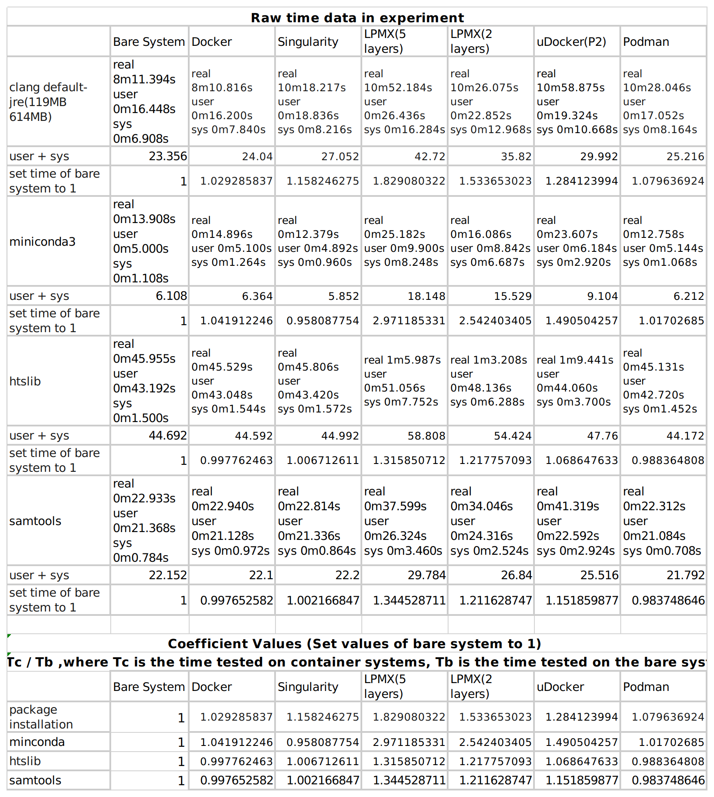
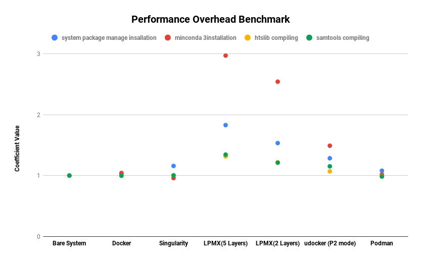

# Experiments Attachments For LPMX
This repository contains performance overhead benchmark experiment scripts and results.
To do the experiment, a virtual machine available on Vagrant Cloud [https://app.vagrantup.com/jasonyangshadow/boxes/benchmark_ubuntu1604](https://app.vagrantup.com/jasonyangshadow/boxes/benchmark_ubuntu1604) is needed to reproduce all compared container system candidates. 

## Requirement
1. Vagrant [https://www.vagrantup.com/](https://www.vagrantup.com/)
2. Oracle VM Virtualbox [https://www.virtualbox.org/](https://www.virtualbox.org/)

## To reproduce the experiment environment
open the terminal on your machine and type the following commands:
```
vagrant box add jasonyangshadow/benchmark_ubuntu1604
vagrant init jasonyangshadow/benchmark_ubuntu1604 
vagrant up
vagrant ssh
```
Then you are in the virtual machine and all containers used in the experiment are configured and installed properly

A shells script named "installation_benchmark.sh" inside the home directory is used for package installation performance benchmark test. It contains necessary bash commands for automating the experiment, just run it by the following command:

The time cost for installing packages is evaluated by the **time** command available in the Linux system.
```
cd ~ && ./installation_benchmark.sh
```



rainbow.R is used for drawing rainbow figure based on the data read from xls file.

